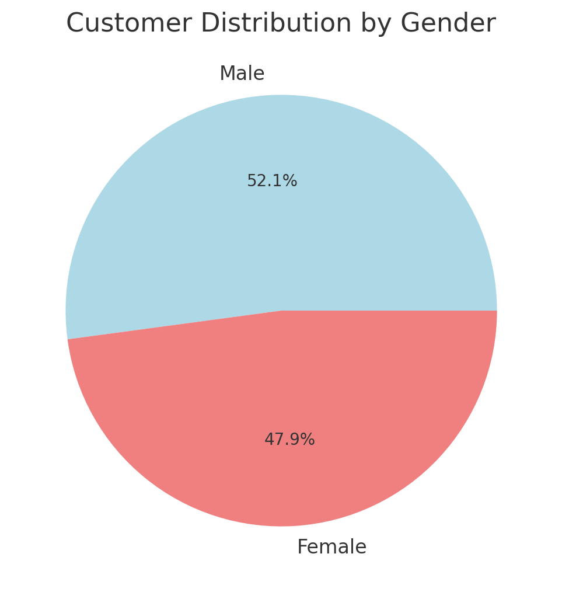

### Exploratory Data Analysis (EDA) Insights

1. Sales Trends:

The total sales trend fluctuates over time, indicating periodic spikes and dips in revenue.

2. Product Performance:

Some product lines contribute significantly more revenue than others, highlighting potential bestsellers.

3. Customer Demographics:

The gender distribution among customers is relatively balanced, meaning no strong gender-based preference.

4. Payment Preferences:

Customers use a variety of payment methods, with some methods being more preferred than others.

5. Statistical Summary:

Average unit price: $55.89

Average quantity per transaction: 5.5 items

Average total sales per transaction: $323.50

Customer ratings range from 4 to 10, with an average of 6.97.

Next Steps:

Further segmentation analysis to understand customer purchasing behaviors.

Profitability analysis for different product lines.

Time-series forecasting for sales prediction.